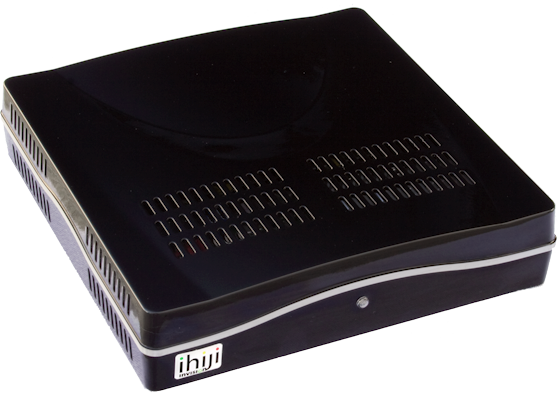
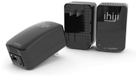

# From Zero to Cloud in 90 Days with Chef

Created by Brad Knowles

Based on materials from Chef Fundamentals OPS150-04.01 by Opscode, Inc.

.notes These materials are Copyright © 2012 Brad Knowles,
All rights reserved.  Based on work that is Copyright © 2010-2012
Opscode, Inc., All rights reserved.  This work is licensed under a
Creative Commons Attribution Share Alike 3.0 United States License.
To view a copy of this license, visit
http://creativecommons.org/licenses/by-sa/3.0/us; or send a letter
to Creative Commons, 171 2nd Street, Suite 300, San Francisco,
California, 94105, USA.

# Speaker

* Name: Brad Knowles
* Company: ihiji, Inc.
* Experience:
    * System Administrator/Engineer/Consultant: 20+ years
    * Chef user: since 2011-09-14
* Contact
    * E-mail: bknowles@ihiji.com
    * Twitter: @bradknowles
    * github: bknowles

.notes I tell you how long I've been a Chef user not to brag or anything,
but to hopefully inspire others that they can follow in my footsteps and
get up to speed with Chef as quickly as I did, or maybe even faster.

# What does ihiji do?

ihiji invision is a web based solution that provides a secure gateway
for residential electronics systems contractors & integrators to
remotely monitor, service and maintain client's in-home electronic
systems, including but not limited to, audio & video equipment,
network devices, etc....

This comprises an on-premise appliance and back-end supporting cloud
infrastructure with web portal for dealers to remotely monitor and
manage equipment that is installed at the client site

.notes Also included are media servers, home
computers, UPSes & PDUs, printers, projectors, temperature sensors,
video conferencing equipment, lighting equipment, and so on.

# What Can Be Monitored?

* Any IP Device
    + Ping
    + Well known ports and services (e.g., HTTP, FTP, Telnet, SSH, etc...)
    + Any device supporting SNMP
    + Control4 devices
* Any RS-232, Zigbee, AMX AxLink or Crestron Cresnet Device
* Custom monitoring modules can be written to support any IP based AV device

# What Do The Appliances Look Like?

.notes The appliance on the top is the older INV-APP-1000 (7.1" x 7.1" x
1.7"), the one at the bottom is the newer INV-APP-500 (3.27" x 2.05"
x 1.70").  The newer one takes up less than 15% of the volume of the
older one, and one-third the power.

# Problem

Company is growing fast, but old ad-hoc hand-built infrastructure
can't scale nor can it be (easily) made fault-resilient

.notes Not yet at the "hockey stick growth" stage, but the cloud
infrastructure had basically gone as far as it could go.  In other words,
it looked pretty much like this ...

# Problem

Company is growing fast, but old ad-hoc hand-built infrastructure
can't scale nor can it be (easily) made fault-resilient

By Ferdinand Reus from Arnhem, Holland (Safari Uploaded by mangostar)

[<a href="www.creativecommons.org/licenses/by-sa/2.0">CC-BY-SA-2.0</a>],
<a href='http://commons.wikimedia.org/wiki/File%3AOverloaded_truck.jpg'>via
Wikimedia Commons</a>

# Solution

* Rebuild from scratch
* In the cloud
* Must be scalable
* Must perform well
* Must be fault-resilient
* Must be very competitive re: cost/performance
* Using repeatable automated infrastructure management systems

# Introducing Chef

# Chef Can Help

Chef is designed to help manage this kind of complexity. You may have
met already!

* Configuration management tool
* Systems integration framework
* API for infrastructure management

.notes It is both a dessert topping and a floor wax!  ;-)
