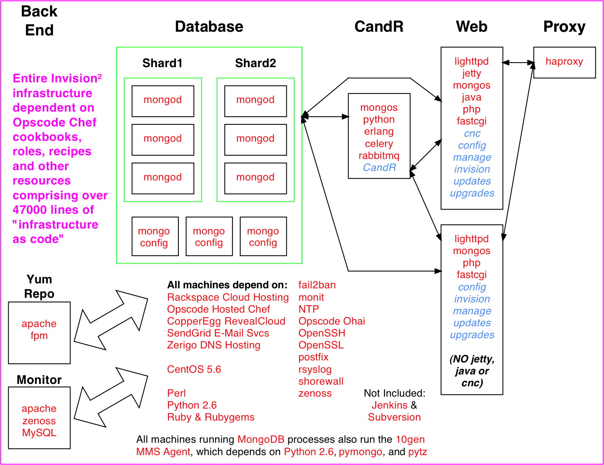
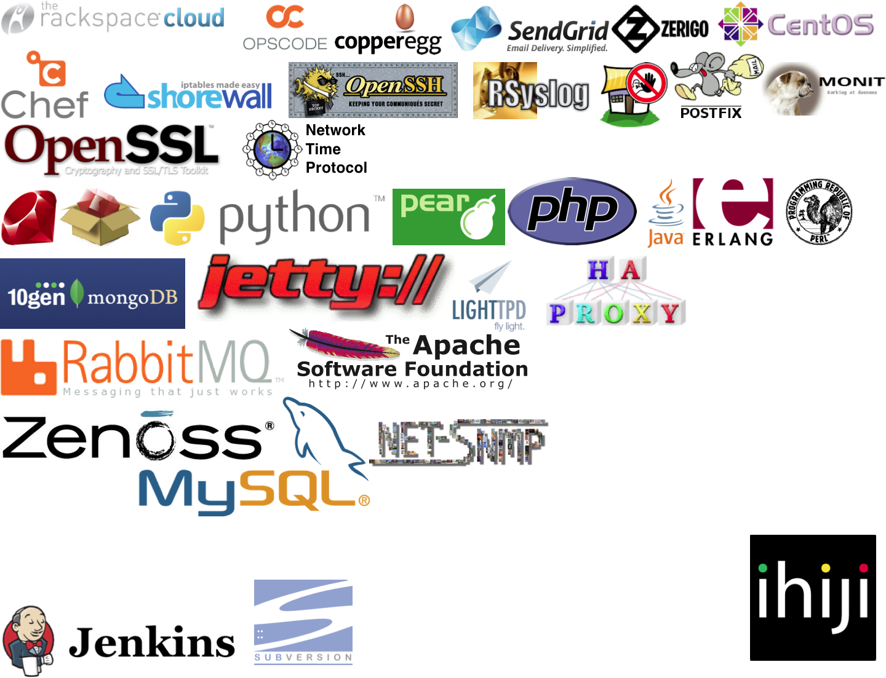
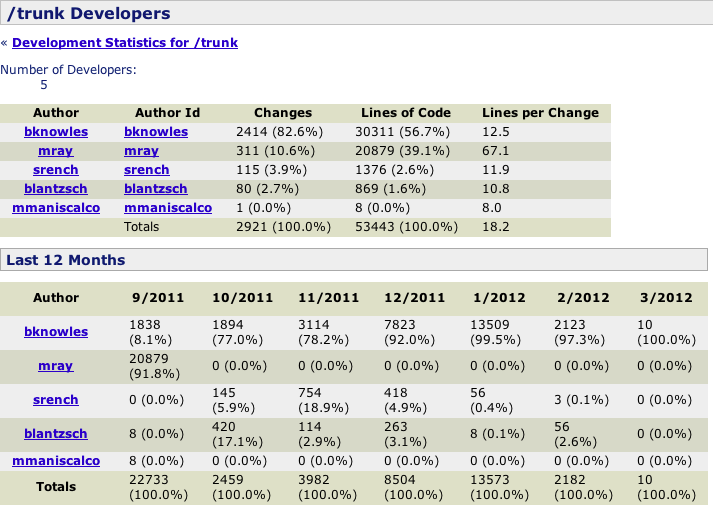
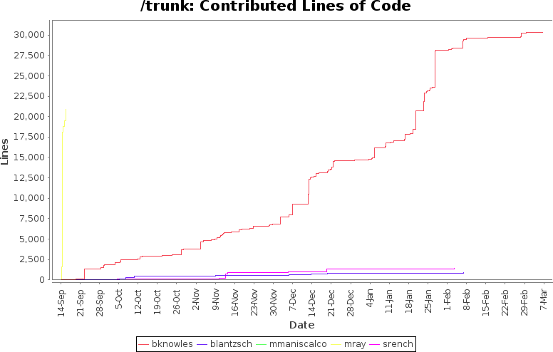
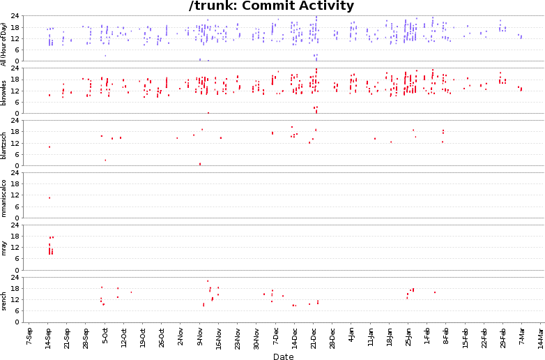

# Second Problem

* I knew chef existed, but that was about it

* I had a little prior exposure to configuration management tools (cfengine, bcfg2)
    + Only ever as a user of their services
    + Never as an admin or engineer who implemented them

* I am __not__ a developer

.notes I am a mail systems guy.  I am a DNS guy.  I am an NTP guy.
I do systems infrastructure.  I help design and implement highly
scalable systems.  But I had no previous cloud experience.

# On the Plus Side

* I did have 20+ years of experience as a Unix/Linux System Administrator/Engineer/Consultant

* I knew and trusted Matt Ray from his days at Zenoss

* Matt convinced both me and the customer that I could do this job with some training and hands-on experience

# Solution Diagram

.notes The stuff in orange is standard open source/freely available
software (including cookbooks).  The stuff in blue is code we wrote
ourselves, including cookbooks.  The green box is the MongoDB
cluster set up in a sharded/replicaset environment with
fault-resilient features.  Yes, we do have some SPOFs we need to
eliminate.  Finally, we now have more than 47k lines of
"infrastructure as code".

# Solution Logos

.notes The NTP logo is one that I created myself for the NTP Public
Services project, years ago.  Perl is mostly used on the appliances and not
so much on the server side, but we list it anyway.  We are preparing to rip
haproxy out and replace it with nginx, and we will probably also replace
lighttpd with nginx.  We would also like to get rid of apache and replace
it with nginx, or maybe lighttpd.

# How Did We Get There?

* I Started work on August 16th, 2011
* In-depth interviews with management regarding current system design
* Reverse-engineer current systems
* Discover what needed to change and what could remain
* Working from first principles, deliver design documents:
    + High Level Architecture (40k foot)
    + Mid Level Services (10k foot)
    + Detail Level (one service @ 5k foot)
    + Project Goals
    + Rules of Thumb for Scalability
    + Next-generation Services and Service Names
* Use a couple of cloud instances to do some early testing

.notes However, I was basically just spinning my wheels.  I was trying to
come up to speed on Chef, and not having any luck.  The available
documentation and materials just weren't helping me in the way I needed to
be helped.  Fortunately, they decided to stick with me, until we had gotten
actual training on the software.

# Training & Consulting

* Chef Fundamentals with Matt Ray
    + September 13th, 2011
* Rapid Prototype Infrastructure
    + Afternoon/Evening of September 13th, 2011
    + My first commit was on September 14th, 2011
    + Consulting complete by evening of September 15th, 2011

.notes Yes, that's a three-day class compressed into slightly less
than one day.  Yes, my brain was mush by the end.  I'm a
visual/hands-on learner -- I learn better by doing than by seeing,
and seeing better than hearing, and I learn best by having hands-on
in combination with seeing.

# Developers

.notes We were notified in November that we would be launching before the
end of December.  The week before Christmas rolls around, and ... we learn
many ways not to make a lightbulb.  Fortunately, all of the code I was
responsible for was working fine, so I helped others out as best I could,
but we still didn't manage to launch.

# Commit Timeline

.notes January rolls around, and we need to launch again.  Only this time,
new testing procedures break apache so badly that we are forced to halt all
other work as I scramble like a madman to rip it out and get an alternative
up and running.  For weeks, I am holding up the entire company.

# Contributed Lines of Code

.notes We get into February, and it is time to try to launch again.  This
time, lighttpd and haproxy are fine and tested to handle at least 10x the
current production load, albeit with heavy load.  Again, the culprit is not
the code I am responsible for.

# Commit Heat Map

.notes On Feb 2nd, by 6PM I've basically done all the work I can.  Went
home at midnight.  Came into the office at 9AM on the 3rd, and found
out that they had stayed overnight and had actually launched just
a few minutes before I walked in the door.  Work starts on nginx
on the 6th.
